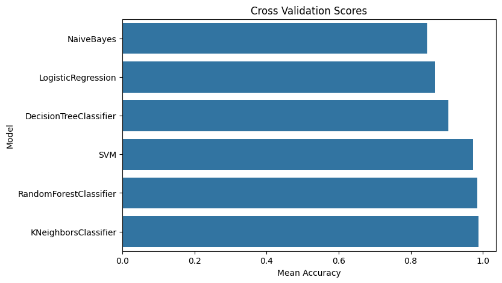

# Heart-Disease-Prediction

This project is a machine learning-based web application for predicting the likelihood of heart disease. The application is built with FastAPI for the API service and Docker for containerization. The trained model is deployed as a REST API that takes patient data as input and returns a prediction of whether the patient has heart disease or not.

## Project Structure

- `server.py`: Main FastAPI application code that loads the model and defines prediction endpoints.
- `Dockerfile`: Configuration file for building the Docker image.
- `requirements.txt`: List of Python dependencies required by the project.
- `best_model.joblib`: Pre-trained machine learning model saved in Joblib format.
- `EDA_Model.ipynb`: Jupyter Notebook containing exploratory data analysis (EDA) and model training (optional).

## Getting Started

These instructions will help you set up the project and run the application locally or with Docker.

### Prerequisites

- Python 3.8+
- Docker (optional, if you want to run the application in a container)
- Git

### Installation

1. Clone the repository:

   ```bash
   git clone https://github.com/<your-username>/heart-disease-prediction.git
   cd heart-disease-prediction
2. Install the required packages:

   ```bash
   pip install -r requirements.txt
3. Run the FastAPI application:
   ```bash
   uvicorn server:app --host 0.0.0.0 --port 8000

### Running with Docker

1. Build the Docker image:
   ```bash
   docker build -t heart-disease-prediction .
3. Run the Docker container:
   ```bash
   docker run --name container_heart -p 8000:8000 heart-disease-prediction
## Model Performance

The following plot shows the mean accuracy scores of different models after cross-validation:



From the above plot, the **KNeighborsClassifier** model achieved the highest mean accuracy score, making it the best model for this heart disease prediction task.


## API Endpoints
- GET / - Root endpoint to test if the API is working.
- POST /predict - Endpoint for heart disease prediction.
  
### Example Request
To predict heart disease, send a POST request to /predict with the following JSON payload:
   ```bash
    curl -X POST "http://localhost:8000/predict" -H "Content-Type: application/json" -d '{
    "features": [57, 130, 250, 135, 1.4, 1, 0, 1, 0, 0, 0, 1, 0, 1, 0, 0, 1, 0, 1, 0, 0, 1, 0, 0, 0, 1, 0, 0]
     }'


      


